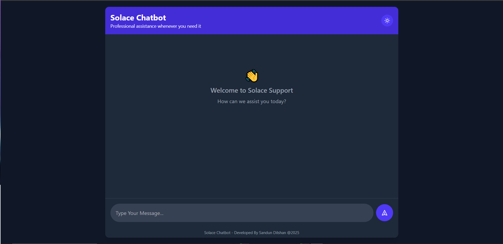
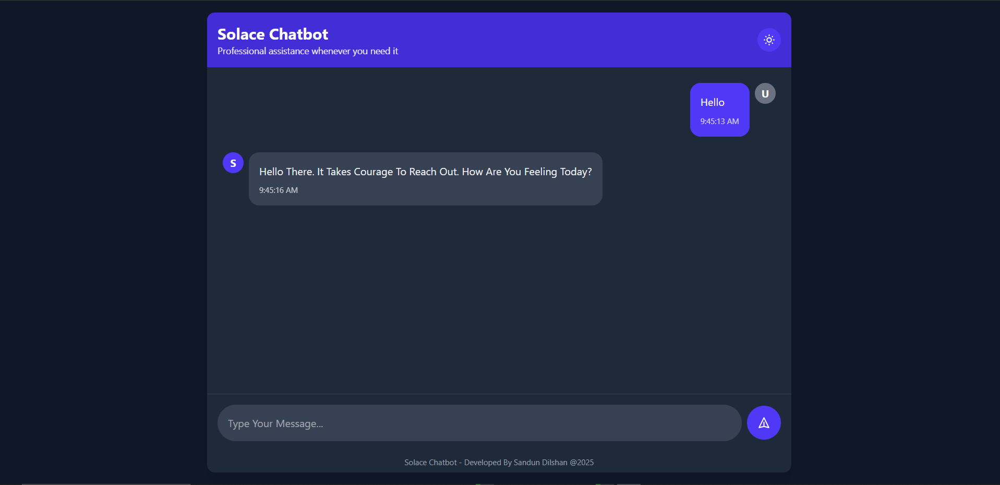
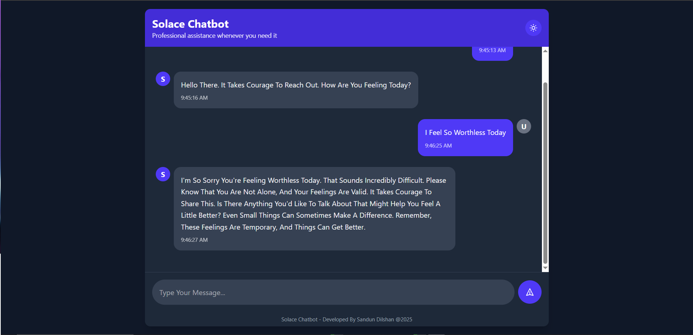
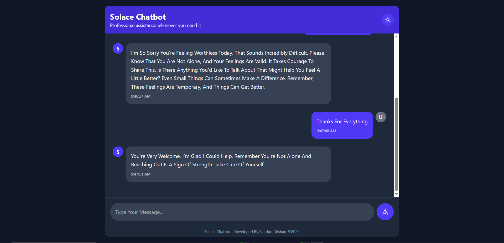

<h1 align="center" id="title"><a href="https://git.io/typing-svg"></a></h1>

<p align="center"></p>

<p id="description">Solace Chatbot is a responsive web application that connects users with an AI assistant capable of answering questions and providing support. Built with React and TypeScript the application features a clean professional UI with seamless dark/light theme switching to accommodate user preferences.</p>

<h2>Project Screenshots:</h2>






  
  
<h2>🧐 Features</h2>

Here're some of the project's best features:

*   AI-Powered Responses: Intelligent chatbot providing helpful contextual answers
*   Theme Support: Elegant dark and light mode with system preference detection
*   Responsive Design: Optimized for all device sizes from mobile to desktop
*   Real-Time Interaction: Immediate responses with loading indicators
*   Professional UI: Clean modern interface with smooth transitions and animations


<h2>🛠️ Installation Steps:</h2>

<p>1. Clone the repository</p>

```
git clone https://github.com/sandundil2002/Solace_Chatbot.git
```

<p>2. Install frontend dependencies</p>

```
npm install
```

<p>3. Setup backend</p>

```
cd server npm install
```

<p>4. Create a .env file in the server directory with your API credentials</p>

```
GEMINI_API_KEY=your_gemini_api_key
```

<p>5. Start the frontend development server</p>

```
npm run dev
```

<p>6. Start the backend server</p>

```
cd server npm start
```

<p>7. Open your browser and navigate to</p>

```
http://localhost:5173
```
  
  
<h2>💻 Built with</h2>

Technologies used in the project:

*   React: UI library for building component-based interfaces
*   TypeScript: Static typing for improved code quality and developer experience
*   TailwindCSS: Utility-first CSS framework for styling
*   Axios: HTTP client for API requests
*   Node.js: JavaScript runtime for the server environment
*   Express: Web framework for handling HTTP requests
*   AI Integration: Connection to gemini-1.5-flash model API for generating responses

<h2>🛡️ License:</h2>

This project is licensed under the MIT License - see the LICENSE file for details.
